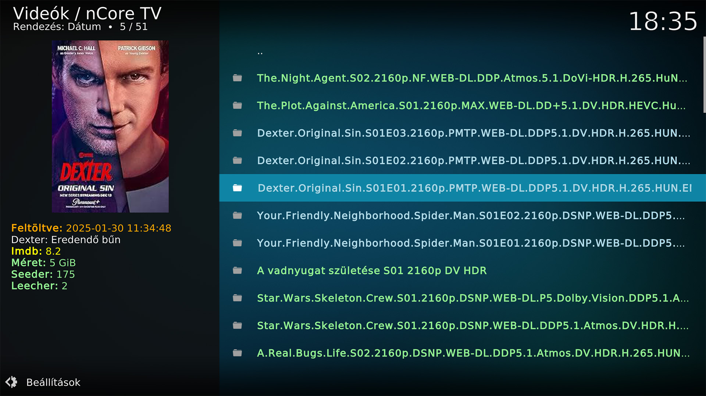

# nCore TV (fork)

> ## ⚠️ Ez NEM az eredeti addon
> Ez az addon **nem az enyém**. Az eredeti **nCore TV** addon szerzője **heg** (az `addon.xml` `provider-name` mezője és a forrásfájlok szerzői jogi fejlécei szerint). Ez a repó egy **nem hivatalos, saját módosított változat (fork)**, amelyet **TomSzo** tart karban a saját használatára és kényelmére.
>
> - Az eredeti projekt a **MovieShark Kodi-tárolóban** érhető el: **[repo.mvshrk.xyz](https://repo.mvshrk.xyz/)**
> - A fork **nem az eredeti szerző hivatalos kiadása**, az eredeti szerző nem felelős a benne található hibákért. **A fork hibáival ne az eredeti szerzőt keresd.**
> - A fork **nem hivatalos kiadás**, és nem áll kapcsolatban az nCore, a TMDb, a Trakt, a Simkl, a Plex, a Kodi, a CoreELEC és az Elementum projektekkel.

*This is an unofficial, personally modified fork of the "nCore TV" Kodi addon. The original author is **heg**; I did not write the original addon. Licensed under GPL-3.0-or-later, as the original.*

## Mi ez?

Kodi videó-addon, amellyel az [ncore.pro](https://ncore.pro/) tartalmait lehet böngészni és lejátszani (torrent-lejátszás Elementumon keresztül), Trakt/Simkl/Plex-szinkronnal, évadpakk-kezelővel és további funkciókkal. **Az addon használatához nCore-fiók kell.**

## Miben más ez a fork?

A teljes, részletes lista: **[CHANGELOG.md](CHANGELOG.md)**. Röviden:

- **TMDb Helper player** – az addon lejátszóként használható a TMDb Helperből (*Auto Play* és *Source Select*), színkódolt, rövid verzió-címkékkel (felbontás, REMUX, DV/HDR, kiadás, hang, forrás, seeder).
- **REMUX-keresés és minőség-felismerés** – REMUX szűrő és kategóriák, DV-profil, HDR10+, BD50, TC/TS/CAM jelzés, kiadás-címkék (Extended, Director's Cut, …), minőség szerinti rendezés. **Rendezés-választó ablak** a kategóriák megnyitásakor (feltöltés ideje, seed, letöltések, méret, név); a Widgetek között REMUX seed szerint is. **Kiadások összevonása** („N verzió”, színkódolt verzióválasztóval) és **halott torrentek elrejtése** (minimum seed).
- **Ajánlók nCore-elérhetőséggel:** minden ajánlott cím mellett látszik, hány élő verzió van fent nCore-on (és milyen minőségben), kattintásra egyből a színkódolt verzióválasztó jön; a nem elérhetők elrejthetők. Átszervezett menü, **Magyar streaming-kínálat** (Netflix, HBO Max, Disney+, Prime Video, Apple TV+, SkyShowtime – magyar régió).
- **Szerep szerinti szűrés** a színész-keresésnél és a stáblistánál: színészként / rendezőként / producerként / íróként, filmek és sorozatok külön.
- **Bal oldali leírás-panel** a film / sorozat listákban (Lista nézet): TMDb leírás, **IMDb**, **Rotten Tomatoes**, **Metacritic** és TMDb pontszám. Az RT / Metacritic értékhez ingyenes **OMDb** vagy **MDBList** API-kulcs kell (Beállítások → Helyi funkciók); ha üres, a TMDb Helperben megadott kulcsot használja.
- **Widget mód** – skin-widgetnek választható, dialógusmentes listák (Widgetek menü).
- **Helyi funkciók** (Beállítások) – lokális lejátszás-követés, évadpakk-menü és gyors mód ki/be kapcsolható; a felhő-szinkron (Trakt/Plex/Simkl) ettől függetlenül működik.
- **Sebesség** – kevesebb indításkori hálózati kérés, gyorsabb adatbázis és listaépítés, timeout minden hálózati hívásra (az időmérések tájékoztató jellegűek, lásd a CHANGELOG-ot).

## Telepítés

1. Töltsd le a legfrissebb zipet a **Releases** oldalról *(vagy: `plugin.video.nCore_TV` mappa zip-ként)*.
2. Kodi: *Beállítások → Kiegészítők → Telepítés zip-fájlból*.
3. Kell hozzá: `script.module.beautifulsoup4`, `script.module.requests`, `script.module.pyxbmct`, és torrent-lejátszáshoz az **Elementum** (Kodi 19 Matrix vagy újabb).
4. Az addon azonosítója **megegyezik az eredetiével** (`plugin.video.nCore_TV`), ezért az eredeti helyére települ, és átveszi a meglévő beállításokat és adatbázist. **Telepítés előtt érdemes biztonsági mentést készíteni.** A fork verziószáma (1.2.0) magasabb az eredeti 1.1.x-nél, így az eredeti repó frissítései nem írják felül.

## TMDb Helper használata

1. Telepítsd a TMDb Helpert.
2. *nCore TV → Beállítások → Helyi funkciók → „TMDb Helper playerek telepítése"*. A gomb kiírja, hová másolta a fájlokat.
3. TMDb Helper: film/epizód lejátszásakor válaszd az **nCore TV (Auto Play)** vagy az **nCore TV (Source Select)** opciót (vagy állítsd be alapértelmezett lejátszónak).
4. A minőségi előnyt a *Helyi funkciók → TMDb Helper: előnyben részesített minőség* állítja (Auto / REMUX / 2160p / 1080p). Ez előny, nem szűrő: ha nincs REMUX, a legjobb elérhető indul.

> **Miért `xbmc.core` a playerek `plugin` mezője?** Az addon azonosítója nagybetűs (`nCore_TV`), a Kodi viszont a feltételekben kisbetűsít, ezért a `System.HasAddon(...)` hamisat ad, és a TMDb Helper kiszűrné a playert. A lejátszás így is az addon saját útvonalán megy.

## Widget mód

*Főmenü → Widgetek (REMUX / 4K / 1080)*: kész listák, amelyeket a skin widget-beállításában választhatsz ki. Widgetből hívva az addon nem dob fel bejelentkezési/2FA ablakot; lejárt süti esetén egyszer nyisd meg interaktívan az addont.

## Hálózati kapcsolatok és adatvédelem

Az addon a következő külső szolgáltatásokkal kommunikál (a kód alapján):

- **ncore.pro** – tartalom, bejelentkezés (a Kodi-beállításokban megadott adatokkal).
- **OMDb (`omdbapi.com`) / MDBList (`mdblist.com`)** – pontszámok a leírás-panelhez, csak ha van API-kulcs (saját vagy a TMDb Helperé). Csak az IMDb-azonosító megy el.
- **TMDb, IMDb, Simkl, Trakt, Plex, JustWatch, TheTVDB** – metaadatok, ill. a felhő-szinkron (csak ha bekapcsolod).
- **GitHub (raw.githubusercontent.com, `sk8ordi3/update` repó)** – két külső segédfájl (színész-keresés hash-ei, egy menü-jelző). Az eredeti addon ezeket minden indításkor letöltötte; a fork **legfeljebb 12 óránként** tölti, és lokálisan gyorsítótárazza.
- **Telemetria (az eredeti addon része, változatlanul):** sikeres bejelentkezéskor/hitelesítéskor (nCore, Trakt, Simkl, Plex) az addon egy esemény-üzenetet küld a **LogSnag** szolgáltatásnak (`api.logsnag.com`), az eseményben szerepel az esemény neve, az időpont és egy 12 karakteres azonosító. Ez az azonosító a (kisbetűsített) felhasználónév és egy, a forráskódban rögzített állandó SHA-256 hash-ének első 12 karaktere. Mivel az állandó a kódban megtalálható, ez **álnevesített, nem valóban névtelen** azonosító. A küldés háttérszálon fut, hiba esetén csendben kimarad. *(Ezt a viselkedést a fork nem változtatta meg.)*

## Tesztelt környezet és ismert korlátok

- Fejlesztői környezet: **CoreELEC, Kodi 21.3 (Omega)**, Homatics Box R 4K Plus (Amlogic S905X4-K), USB-pendrive-ról futó rendszer; TMDb Helper + Elementum (RAM-tárolóval).
- **Nincs mindenre kiterjedően tesztelve.** A fejlesztés jelentős része szintetikus teszteken (Kodi-stubok, mintaoldalak) készült, valódi eszközön és a valódi nCore-oldalon nem minden rész lett kipróbálva.
- A Source Select dialógus megjelenése skin-függő; a TMDb Helper-integráció a TMDb Helper változóinak nevére épít.
- Részletek: [CHANGELOG.md → Ismert korlátok](CHANGELOG.md#ismert-korlátok).

## Hibajelentés

Csak a **fork** hibáit ide jelentsd (Issues), lehetőleg a `kodi.log` releváns részével. Az eredeti addon hibáit az eredeti projektnél jelezd. *A fork „ahogy van" (as is) érhető el, támogatást nem vállalok.*

## Licenc és szerzői jog

- Az eredeti addon: **Copyright (C) heg**, **GNU General Public License v3.0 vagy újabb** (lásd [LICENSE.txt](LICENSE.txt)).
- A fork módosításai: **Copyright (C) 2026 TomSzo**, ugyanazon licenc alatt (GPL-3.0-or-later).
- A módosított fájlok fejlécében szerepel a módosítás ténye és dátuma (2026-09-20), a részletes lista a [CHANGELOG.md](CHANGELOG.md) „Módosított és új fájlok" táblázatában van. Az eredeti szerzői jogi közlemények megmaradtak.
- A képernyőképek az eredeti projektből származnak.
- A GPL értelmében a teljes forráskód elérhető ebben a repóban.
