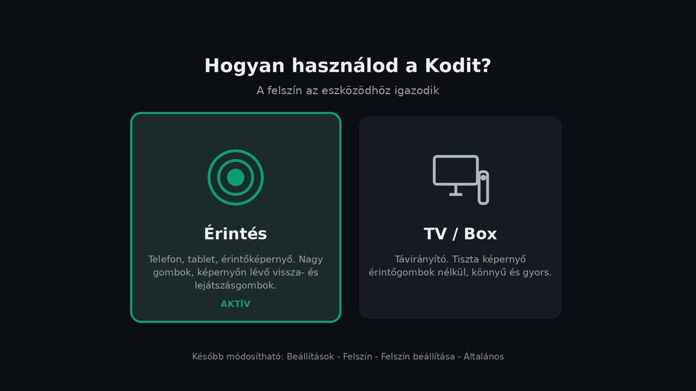
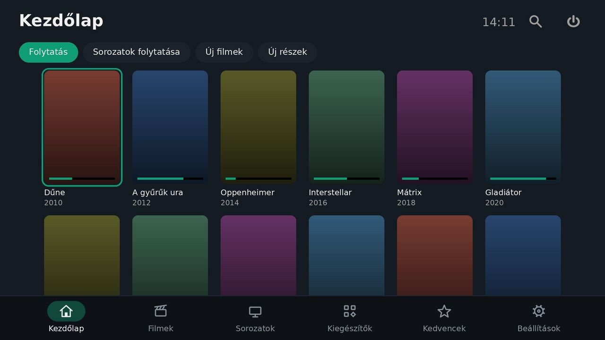
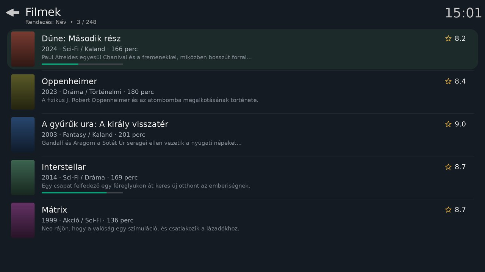

# TomSzo Touch (skin.tomszo.touch)

Érintésre optimalizált, könnyű Kodi skin **Kodi 22 „Piers”**-hez, elsősorban **Androidra**
(telefon, tablet, érintőképernyős TV-box). A Kodi gyári **Estuary** skinjének (4.1.0) forkja,
ezért minden ablak és funkció ugyanúgy működik, mint a gyári felszínen.

## Két mód: Érintés vagy TV / Box

Első indításkor egy felugró ablak két nagy kártyával megkérdezi, hogyan használod a Kodit:

| Mód | Mire való? |
|-----|------------|
| **Érintés** | Telefon, tablet, érintőképernyő – nagy gombok, képernyőn lévő vissza- és lejátszásgombok |
| **TV / Box** | Távirányító – tiszta képernyő érintőgombok nélkül, könnyű és gyors |

Később bármikor váltható: *Beállítások → Felszín → Felszín beállítása → Általános → Kezelési mód*.

## App-szerű kezdőképernyő (Érintés mód)

Érintés módban a kezdőképernyő úgy működik, mint egy telefonos app:

- **alul fix menüsáv:** Kezdőlap · Filmek · Sorozatok · Kiegészítők · Kedvencek · Beállítások
- **fent:** a fül címe, óra, keresés, kikapcsolás és szűrőgombok
  - Kezdőlap: Folytatás · Sorozatok folytatása · Új filmek · Új részek
  - Filmek: Összes · Nem látott · Új filmek · Gyűjtemények
  - Sorozatok: Összes · Folyamatban · Új részek · Nem látott
  - Kiegészítők: Videó · Programok · Zene
- **középen:** csak függőlegesen görgethető poszterrács. Egy görgetési irány van, ezért a húzás nem akad.

TV / Box módban az eredeti Estuary kezdőképernyő marad.

## Mobilos nézetek (Érintés mód)

A filmek, sorozatok, kiegészítők és programok listáiban két új nézet van. A *Nézettípus* menüben választhatók (oldalmenü: kétujjas húzás jobbra), Érintés módban ezek az alapértelmezettek:

- **Mobil lista:** sorok kis poszterrel, cím, *évszám · műfaj · hossz*, egysoros leírás, értékelés ★ és haladásjelző
- **Kártyák:** függőlegesen görgethető poszterrács (filmek, sorozatok, gyűjtemények, évadok)

## Mi más, mint az Estuary?

| Terület | Változás |
|---------|----------|
| Kinézet | Minimalista, sötét „flat” stílus: egyszínű háttér minta nélkül, sötét dialógusok |
| Érintés mód | Ujjal húzva, lendülettel görgethető listák; képernyőn lévő *Vissza*, *Beállítások*, *Hangerő*, *Kedvencek* gombok, görgetősáv a kezdőlap-sorokon |
| Videó OSD | Nagy, középre helyezett gombok: **-10 mp · lejátszás/szünet · +30 mp** |
| Méretek | Listasorok 75 → 100 px, oldalmenü 80 → 96 px, beállítás-gombok 70 → 86 px |
| Sebesség | Dia animációk **alapból kikapcsolva** (csak áttűnés) |
| Színek | Zöldeskék kiemelőszín, saját ikon és háttérkép |
| Méret | Csak angol + magyar nyelvi fájl |

## Érintés-gesztusok (Kodi alapértelmezés)

| Gesztus | Művelet |
|---------|---------|
| Koppintás | kiválasztás (lejátszás közben: OSD megnyitása) |
| Hosszú nyomás / kétujjas koppintás | helyi menü |
| Kétujjas húzás balra | vissza |
| Kétujjas húzás jobbra | oldalmenü |
| Lejátszás közben húzás balra / jobbra | kis ugrás vissza / előre |
| Lejátszás közben húzás fel / le | nagy ugrás / fejezet előre / vissza |
| Háromujjas koppintás lejátszás közben | lejátszás / szünet |

## Beállítás

- **Mód váltása:** *Beállítások → Felszín → Felszín beállítása → Általános → Kezelési mód*.
- **Animációk vissza:** ugyanitt a **Dia animációk használata**.
- **Kis kijelzőn (telefon) minden túl apró?** *Beállítások → Felszín → Nagyítás* (pl. +6 … +10 %).

## Licenc

Az Estuary licence alapján: CC BY-SA 4.0 és GNU GPL 2.0.
Eredeti szerzők: phil65, Ichabod Fletchman (Team Kodi).
